# Image Generation Research Environment

A personal research environment for implementing, training and evaluating generative image models from scratch using PyTorch. The goal was not to chase state-of-the-art results, but to build a deep understanding of each architecture. how they work, where they struggle, and why.

Models implemented and studied: 
- [**GAN**](#gan---generative-adversarial-network) 
- [**VAE**](#vae---variational-autoencoder)
- [**Diffusion**](#ddpm---denoising-diffusion-probabilistic-model)
- [**Latent Diffusion (LDM)**](#ldm---latent-diffusion-model)

---

## Models & Findings

### GAN - Generative Adversarial Network
*Dataset: CIFAR-10 | Hardware: Intel i5-1135G7 @ 2.40GHz (16GB RAM)*

The GAN was the first model I implemented and the most satisfying to work with out of the four.

Before starting, I found the intuition behind the adversarial training dynamic genuinely compelling: a generator and discriminator competing in a minimax game, each improving in response to the other. But GANs are notoriously temperamental to train, so I followed the [DCGAN](https://arxiv.org/pdf/1511.06434) architecture closely. The goal was a working, stable model rather than an experimental one.

I trained for 150 epochs on my laptop CPU (Intel i5-1135G7), which took roughly 8 hours at ~190s per epoch. Given the implementation speed and compute cost, the results were satisfying. Some generations are recognisable, horses and deer in particular, but they are not going to fool anyone. Tracking five fixed latent vectors across training made it easy to see the model improving epoch by epoch.

Compared to diffusion models, which I worked on later, the GAN's speed and simplicity are striking. There is a reason modern variants like [Latent Diffusion GANs](https://arxiv.org/pdf/2406.11713) remain competitive on sampling speed and generation quality.

**Generated samples - CIFAR-10, 10-150 epochs:**

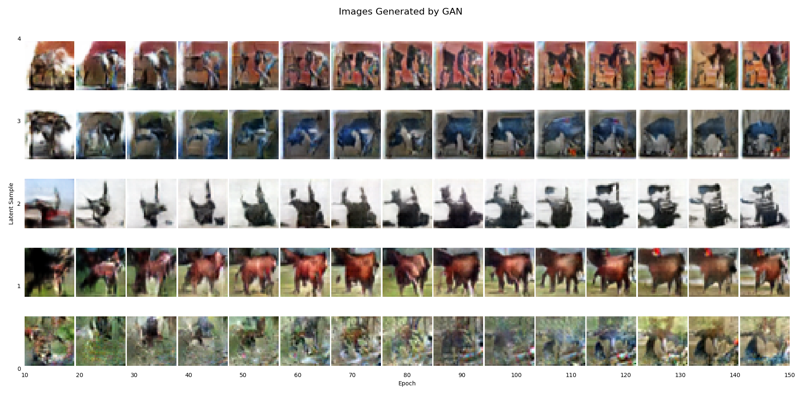

**Training loss:**

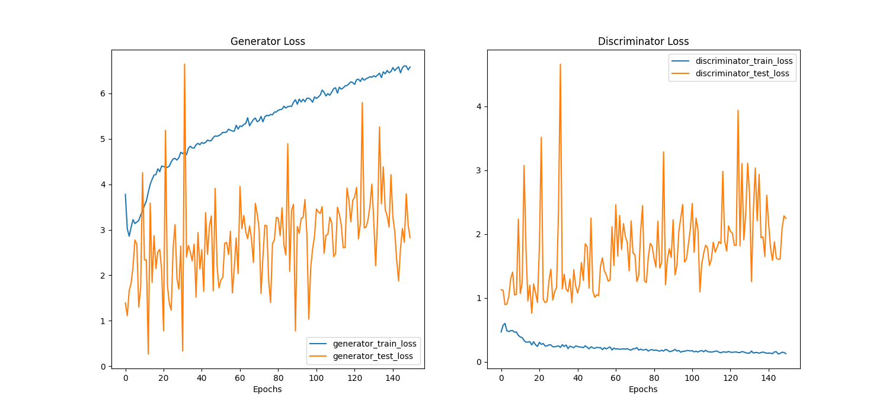

📝 [LinkedIn write-up](https://www.linkedin.com/posts/williamedgington_pytorch-generativeai-gan-activity-7354505989808685056-L6SC?utm_source=share&utm_medium=member_desktop&rcm=ACoAADhvq3kBAiYFGash7JC0MVa1vuLOctbJVkM)

---

### VAE - Variational Autoencoder
*Dataset: CIFAR-10 | Hardware: Intel i5-1135G7 @ 2.40GHz (16GB RAM)*

Samples generated from [VAE](https://arxiv.org/pdf/1312.6114)s are known for their blurriness, and my model was no exception. This trait and the fact that I was trying to generate 32x32 pixel images meant that the generative ability of my VAE was essentially non-existent.

Despite VAEs being subpar synthetic data generators, their ability to act as a smart compressor and also the encoder's ability to become an excellent feature extractor through unsupervised learning fascinated me and makes them still a highly valuable architecture with multiple applications across the deep learning field. This includes [Latent diffusion models](https://arxiv.org/pdf/2112.10752), one of the leading approaches for high-quality image generation, and pre-training steps for classification models.

I became especially fascinated by creating a disentangled feature representation in the encoded latent space. This means, in an ideal scenario, if we were generating faces, there would be an index in the latent space which would modify the ears, one for the eyes, mouth, nose, etc.

**Latent space traversals** - varying a single latent index while holding others fixed:

.png)
.png)
.png)

This led me to develop a [Beta-VAE](https://openreview.net/pdf?id=Sy2fzU9gl). As mentioned in [Higgins et al., 2017](https://openreview.net/pdf?id=Sy2fzU9gl), this involves modifying the classical VAE loss function to give the KL divergence a coefficient called beta. Through training, I found the model tends to neglect whichever loss it finds easier to minimise, often leading to unstable gradients in the other. This means it is very hard to have stable training that leads to a well-balanced model between reconstructive ability and a meaningful latent space. In addition to this, I also had a new hyperparameter value, beta, to worry about.

To solve these two problems, I created an adaptive beta scheduler (inspired by stochastic optimisers such as [Adam](https://arxiv.org/pdf/1412.6980)). This worked by updating the beta value at each epoch in an effort to balance the normalised gradients of both the reconstruction loss and the KL divergence loss.

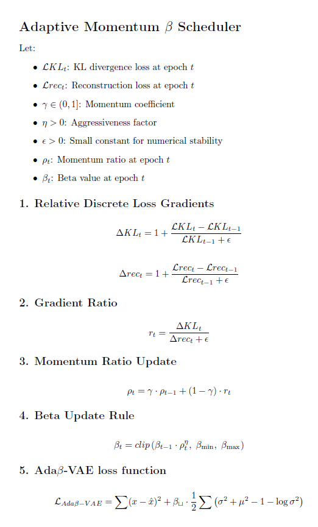

Once the scheduler was implemented, both the KL divergence and reconstruction loss were showing stable downtrends throughout training. Well-balanced models were now achievable without manually tuning beta. This work may have started off as just a mathematical itch, but later became crucial to producing the compression backbone of the LDM seamlessly (which, spoilers, ended up producing the best generations of the whole project).

**Loss comparison - fixed β=1, fixed β=4, adaptive β:**

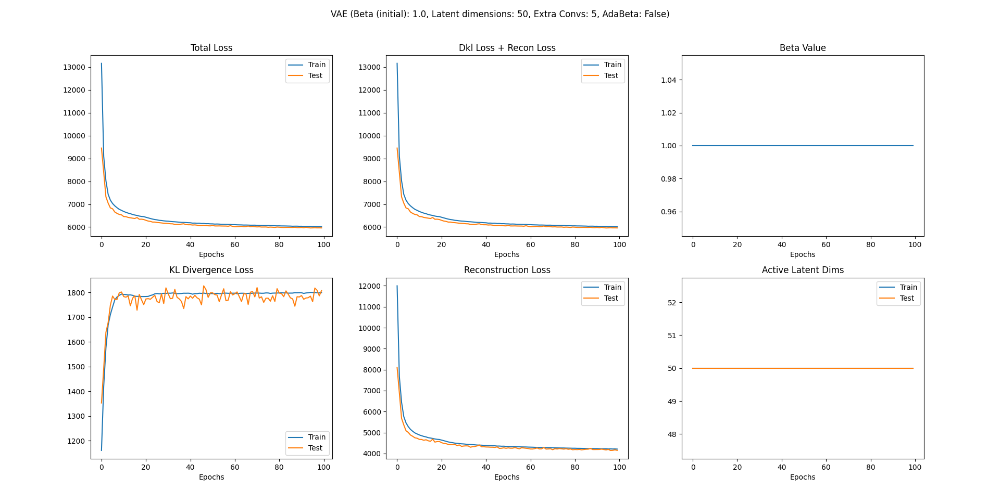
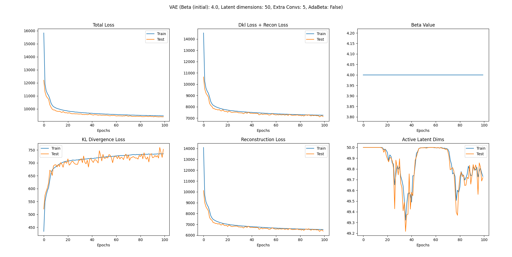
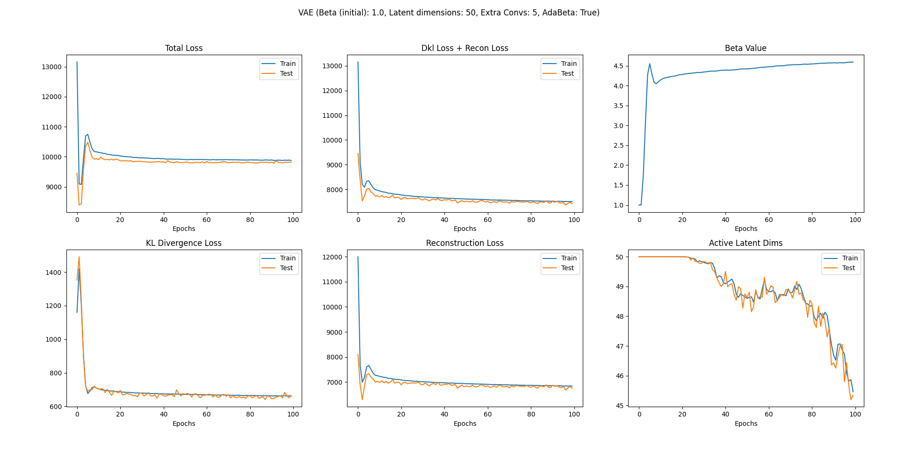

📝 [LinkedIn write-up](https://www.linkedin.com/posts/williamedgington_generativeai-vae-betavae-activity-7358432839668768769-yI-n?utm_source=share&utm_medium=member_desktop&rcm=ACoAADhvq3kBAiYFGash7JC0MVa1vuLOctbJVkM)

---

### DDPM - Denoising Diffusion Probabilistic Model
*Datasets: CIFAR-10, Stanford Cars | Hardware: Nvidia 5070 (8GB VRAM)*

Diffusion models were the most mathematically interesting of the four to work with. Reading through 11 papers covering the core [DDPM](https://arxiv.org/pdf/2006.11239) formulation, noise schedules, score matching and the ELBO derivation made it clear why this area has attracted so much research attention. The reverse diffusion process, in particular, learning to iteratively denoise a signal back to a coherent image, draws connections between gradient descent, physics and chemistry that I found genuinely compelling. One comparison I kept coming back to was thinking of the sampling process as an object moving through space, with external forces acting upon it as it finds its way toward the greatest local mass. This is not far from what actually happens: the model navigates a probability mass landscape, guiding noise toward the cluster most probable to be a genuine sample.

Due to the increase in complexity from previous models, the jump from CPU to GPU was unavoidable here. Even on an Nvidia 5070 with 8GB VRAM, fitting a meaningful UNet into memory required real compromises: reduced base channels, fewer attention heads, decreased model depth and batch sizes as small as 4 for Stanford Cars at 64x64 resolution. Diffusion models are also data hungry by nature, and the relatively small size of both datasets compounded these constraints further. I identified the quadratic memory scaling problem in the attention mechanism and read the FlashAttention paper ([Dao et al. 2022](https://arxiv.org/pdf/2205.14135)) as a potential solution, but kept it as a future improvement and moved on to LDMs to keep the project progressing.

The two noise schedules produced noticeably different behaviour. The linear schedule ([Ho et al. 2020](https://arxiv.org/pdf/2006.11239)) generated sharp images on CIFAR-10, but they lacked specificity. These were generations with sharp structure but no identifiable subject.. The cosine schedule ([Nichol et al. 2021](https://arxiv.org/pdf/2102.09672)) was more volatile. At standard sampling step sizes, the outputs would often collapse into blown-out pixel values, but increasing the step size occasionally produced better object structure, at the cost of consistency.

> The scale limitations made it clear that diffusion models need either significantly more compute or a compressed latent space to be practical, which is the motivation behind LDMs.

**Forward diffusion process - Stanford Cars (linear schedule, T=1000):**

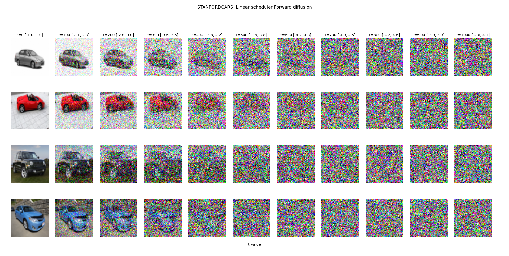

**Generated samples - CIFAR-10, linear schedule, 10-100 epochs:**

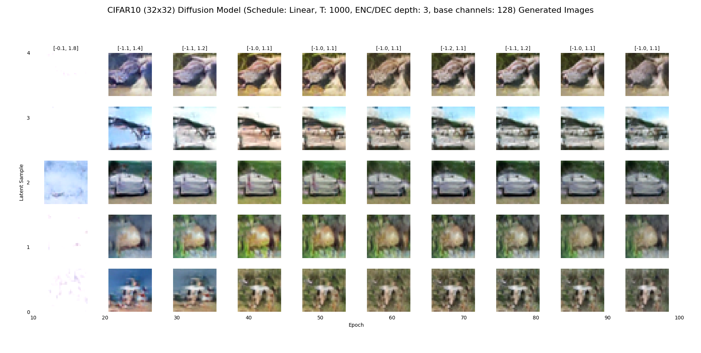

**Reverse diffusion process - Stanford Cars, cosine schedule, 410 epochs:**

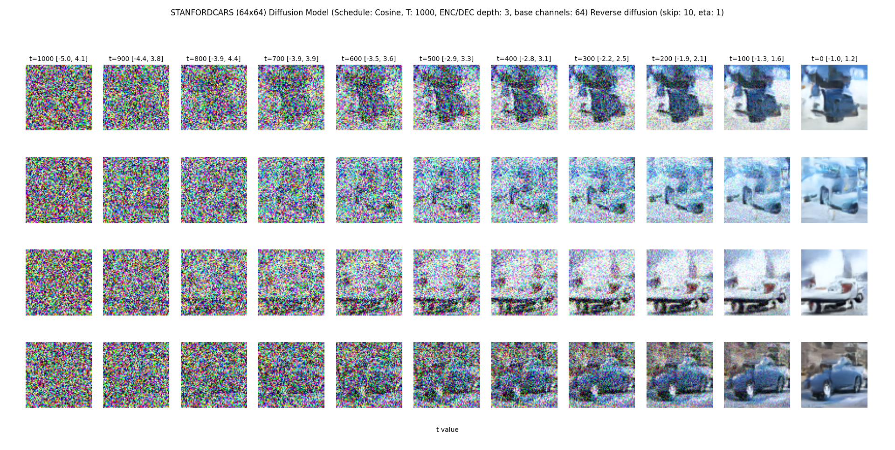

📝 [LinkedIn write-up](https://www.linkedin.com/posts/williamedgington_generativeai-deeplearning-diffusionmodels-activity-7373348212939702272-YPgN?utm_source=share&utm_medium=member_desktop&rcm=ACoAADhvq3kBAiYFGash7JC0MVa1vuLOctbJVkM)

---

### LDM - Latent Diffusion Model
*Datasets: CIFAR-10, Stanford Cars | Hardware: Nvidia 5070 (8GB VRAM)*

Building an [LDM](https://arxiv.org/pdf/2112.10752) gave me the opportunity to use everything I had learnt and implemented throughout the project to build something more relevant to the current direction of generative modelling research. It also ended up being my best model with respect to generative quality.

Latent diffusion models use a VAE to compress a sample down to a latent representation, which a diffusion model then operates on. This immediately addresses the main limitations of both architectures. Without the diffusion model to clean the noisy latent representation before decoding, the VAE's latent space would need to be kept small to give the decoder any chance of producing a meaningful sample. The diffusion model removes that constraint, allowing for a larger, more expressive latent space and reducing the blurriness limitations discussed in the [VAE section](#vae---variational-autoencoder). The compressed latent space also significantly reduces the compute required for the diffusion model. The reconstructive ability of the VAE effectively sets an upper bound on the generative quality of the overall model, which made the autoencoder, in my view, the most critical component of the architecture. The work done on the [adaptive beta scheduler](#vae---variational-autoencoder) during the VAE stage paid off here directly.

Before training, I rewrote the VAE architecture to bring it in line with the quality of the UNet implementation. With the VAE established, I turned to the diffusion model. The key changes from my previous diffusion work were allowing greater architectural depth in the residual blocks and modifying all diffusion-related methods to support the autoencoder, with a strong focus on modularity and backward compatibility. Operating in latent space made it feasible to explore larger batch sizes, deeper models and more attention heads per block, the last of which produced the most notable improvements in generation quality.

**Forward diffusion in latent space - Stanford Cars (cosine schedule, T=1000):**

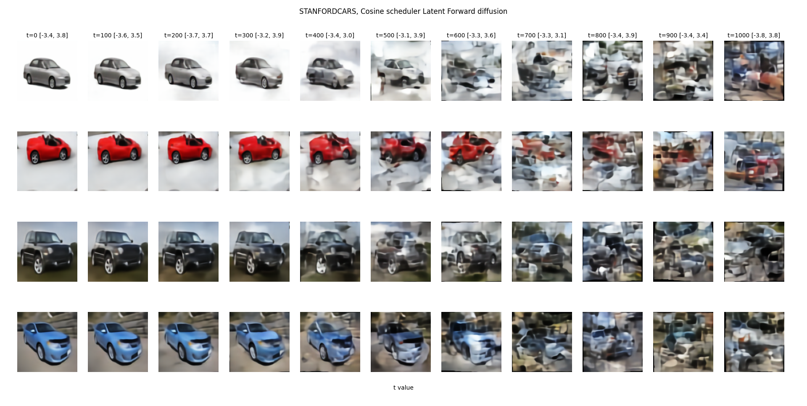

I trained the most successful model on Stanford Cars at 128x128 resolution for 600 epochs. Convincing samples began emerging between epochs 500 and 600.

**Generated samples - Stanford Cars, cosine schedule, 500–600 epochs:**

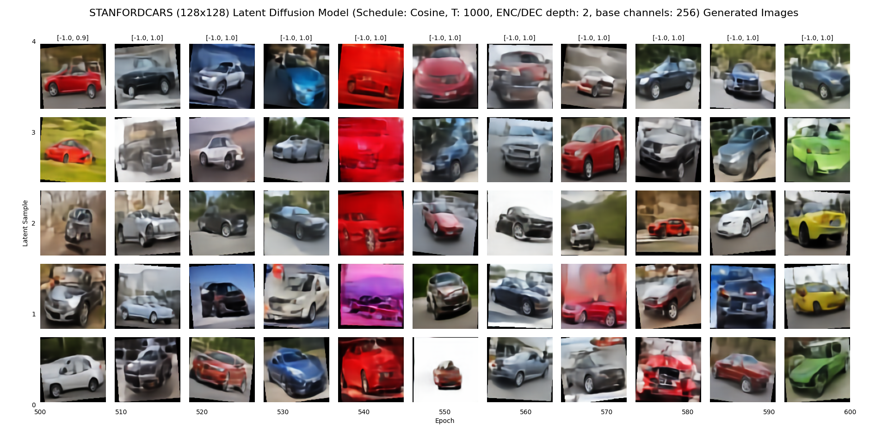

For the latent diffusion model, I created an interesting visualisation. I took a sample image from the test data and noised its latent representation using the forward diffusion process to a given t. At each period, I then performed reverse diffusion using my model and decoded the result. What I found most intriguing about this visual is the sudden point where the model stops attempting to reconstruct the original sample and starts generating something completely unique.

**Reverse diffusion from noised latent - Stanford Cars, cosine schedule, 600 epochs:**

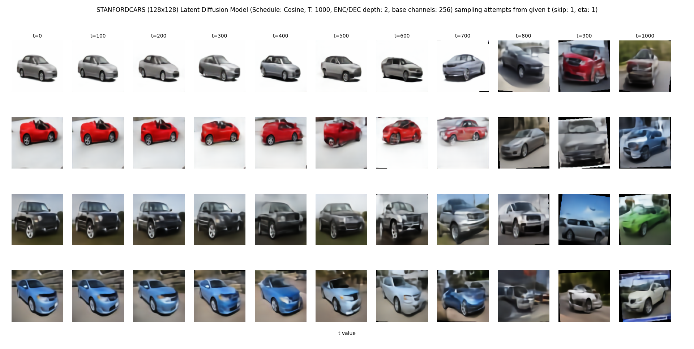

LDMs were a nice capstone to the whole project and something I would like to explore further, particularly [Latent Diffusion GANs](https://arxiv.org/pdf/2406.11713), which offer faster sampling and stronger generative quality through the use of adversarial training.

📝 [LinkedIn write-up](https://www.linkedin.com/posts/williamedgington_latentdiffusion-generativeai-deeplearning-activity-7382453730354515969-HS1l?utm_source=share&utm_medium=member_desktop&rcm=ACoAADhvq3kBAiYFGash7JC0MVa1vuLOctbJVkM)

---

## Repository Structure
```
ImageGenTestEnv/
├── models/                # Model architecture definitions
├── train/                 # Training loops for each model
├── utils/                 # Shared utilities
├── saved_plots/           # Generated samples, loss curves, traversals
├── VAE_run_scripts/       # Scripts to train and evaluate VAE
├── GAN_run_scripts/       # Scripts to train and evaluate GAN
├── Diffusion_run_scripts/ # Scripts to train and evaluate Diffusion model
├── LDM_run_scripts/       # Scripts to train and evaluate LDM
└── requirements.txt
```

---

## Setup & Running

### Requirements

```bash
pip install -r requirements.txt
```

>**NOTE**: A CUDA-capable GPU is recommended for Diffusion and LDM models. VAE and GAN can be trained on CPU.

### Running a model

Each model has its own run scripts directory.

#### To replicate GAN

Train:
```bash
python -m GAN_run_scripts.ganmain
```
Evaluate:
```bash
python -m GAN_run_scripts.evalGan
```

#### To replicate VAE

Train for all experiments:
```bash
python -m VAE_run_scripts.vaeExperiment
```
Evaluate experiments:
```bash
python -m VAE_run_scripts.vaeEvalExperiments
```

#### To replicate Diffusion model

Train:
```bash
python -m Diffusion_run_scripts.DiffusionMain
```

Evaluate:
```bash
python -m Diffusion_run_scripts.DiffusionEval
```

#### To replicate LDM

Train autoencoder (VAE):
```bash
python -m LDM_run_scripts.LDMAutoencoderMain
```

Train diffusion model:
```bash
python -m LDM_run_scripts.LDMDiffusionMain
```

---

## Contact

Created by [WillEdgington](https://github.com/WillEdgington)

📧 [willedge037@gmail.com](mailto:willedge037@gmail.com)

🔗 [LinkedIn](https://www.linkedin.com/in/williamedgington/)
